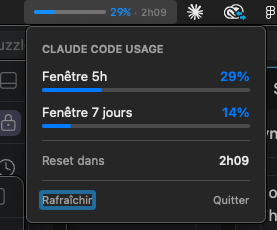

# ClaudeQuotaBar

A lightweight macOS menu bar app that displays your [Claude Code](https://docs.anthropic.com/en/docs/claude-code) usage quota at a glance.



## Features

- **Progress bar** — visual indicator of your 5-hour window usage
- **Percentage + reset timer** — always visible in the menu bar
- **Dropdown details** — 5-hour and 7-day windows, reset countdown
- **Color-coded** — blue (normal), orange (≥50%), red (≥80%)
- **Auto-refresh** — updates every 4 minutes, retries every 30s on error
- **No Dock icon** — runs silently as a menu bar agent

## Requirements

- macOS 14 (Sonoma) or later
- [Claude Code](https://docs.anthropic.com/en/docs/claude-code) installed and authenticated (OAuth token stored in Keychain)
- Xcode Command Line Tools (`xcode-select --install`)

## Install

```bash
git clone https://github.com/manumanmanman/claude-quota-bar.git
cd claude-quota-bar
./build.sh
```

Then copy to Applications and open:

```bash
cp -R .build/ClaudeQuotaBar.app /Applications/
open /Applications/ClaudeQuotaBar.app
```

### Launch at login

Open **System Settings → General → Login Items** and add `ClaudeQuotaBar`.

### Fix repeated Keychain password prompts

If macOS keeps asking for your Keychain password every time ClaudeQuotaBar starts, it means the app doesn't have permanent access to the Claude Code credential entries.

To fix this:

1. Open **Keychain Access** (Spotlight: `Cmd+Space` → "Keychain Access")
2. Search for **`Claude Code-credentials`** — you may find several entries (with suffixes like `-2492a7d2`, `-ac05025e`, etc.)
3. For each entry that shows **"Confirm before allowing access"**:
   - Double-click the entry
   - Go to the **Access Control** tab
   - Click **+** and select `/Applications/ClaudeQuotaBar.app`
   - Click **Save Changes** (you'll need to enter your login password once to confirm)
4. Quit and relaunch ClaudeQuotaBar — no more prompts.

## How it works

1. Reads your Claude Code OAuth token from the macOS Keychain (`Claude Code-credentials`)
2. Calls the Anthropic usage API (`/api/oauth/usage`)
3. Renders a compact progress bar + percentage + reset timer in the menu bar
4. Dropdown window shows both the 5-hour and 7-day usage windows

No API keys are stored in the app — it reads the token that Claude Code already saved in your Keychain.

## Customization

Edit `ClaudeQuotaBar.swift` to adjust:

| Constant | Default | Description |
|----------|---------|-------------|
| `barWidth` | `72` | Progress bar width in points |
| `barHeight` | `4` | Progress bar height in points |
| `refreshInterval` | `240` | Refresh interval in seconds (4 min) |
| `retryInterval` | `30` | Retry interval on error (30s) |

## License

MIT
